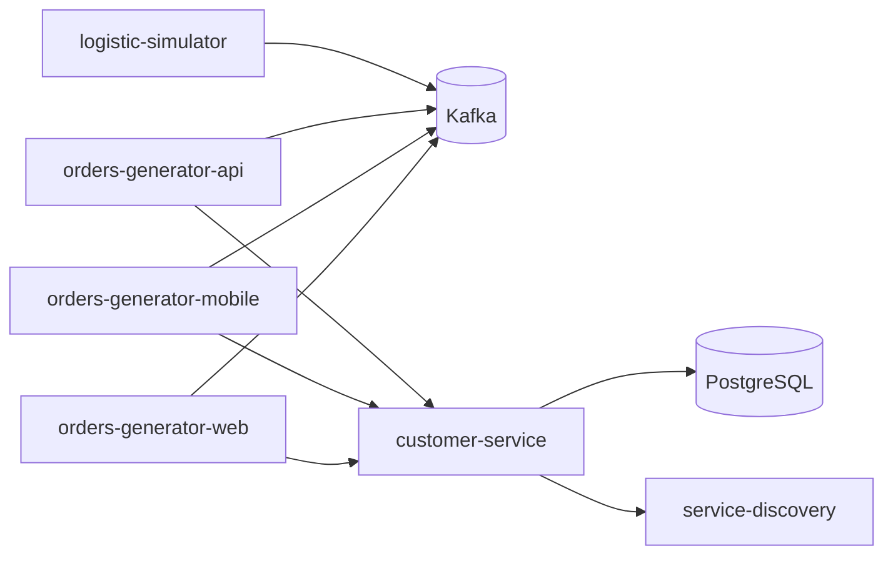

# 🛠 Logistics Platform – Production-like Microservices System

Этот репозиторий содержит **production-like** решение с микросервисной архитектурой. Все сервисы запускаются через `docker-compose`, используют **gRPC**, **Kafka**, **PostgreSQL**, симуляторы нагрузки и Service Discovery.

## 🎯 Что демонстрирует проект

* декомпозицию backend-системы на несколько сервисов;
* gRPC-взаимодействие между сервисами;
* асинхронную обработку заказов через Kafka;
* локальную инфраструктуру через Docker Compose;
* PostgreSQL как persistent storage;
* healthchecks и запуск всей системы одной командой;
* конфигурацию через environment variables.

## 📦 Архитектура

Проект включает **4 микросервиса**, а также необходимые инфраструктурные компоненты:

| Компонент | Назначение |
|---|---|
| `customer-service` | gRPC-сервис для работы с клиентами |
| `orders-generator-*` | Генераторы заказов: Web, Mobile, API |
| `service-discovery` | Service Discovery для распределения кластеров |
| `logistic-simulator` | Симулятор логистики |
| `Kafka (broker-1/2)` | Очередь сообщений |
| `Zookeeper` | Координация Kafka-брокеров |
| `PostgreSQL` | Хранилище данных клиентов |

Все сервисы взаимодействуют через **gRPC** или **Kafka**, используют общие `.proto`-контракты и работают в локальной среде, имитируя продакшн.



## 🚀 Быстрый старт

> ⚠️ Требования: Docker и Docker Compose установлены.

### 1. Клонируйте репозиторий

```bash
git clone https://github.com/steel-snake-sx/logistics-platform.git
cd logistics-platform
```

### 2. Запустите систему

```bash
docker-compose up --build
```

> Используйте `--build`, чтобы пересобрать образы при изменении кода.

### 3. Проверка

После запуска:

* `http://localhost:5081` — gRPC endpoint `customer-service`
* `http://localhost:5500` — Service Discovery HTTP
* Kafka доступна на портах `29091` и `29092`
* PostgreSQL на порту `5400` (`user=test, password=test`)

> Credentials в `docker-compose.yml` предназначены только для локального demo/development запуска.

Все сервисы стартуют с healthcheck'ами и полностью готовы к работе.

## 🧩 Технологии

* [.NET 8 / C# 12](https://learn.microsoft.com/en-us/dotnet/)
* [gRPC](https://grpc.io/)
* [Apache Kafka](https://kafka.apache.org/)
* [Docker Compose](https://docs.docker.com/compose/)
* [PostgreSQL](https://www.postgresql.org/)
* [Zookeeper](https://zookeeper.apache.org/)
* Clean Architecture подход (по слоям)

## 🔧 Структура каталогов

```text
src/
├── LogisticsPlatform.CustomerService
├── LogisticsPlatform.OrdersGenerator
├── LogisticsPlatform.ServiceDiscovery
├── LogisticsPlatform.LogisticsSimulator
```

Каждый сервис содержит `Dockerfile`, настройки и слой инфраструктуры, необходимые для автономного запуска.

## ⚙️ Конфигурация

Основные переменные окружения задаются в `docker-compose.yml`:

| Переменная | Назначение |
|---|---|
| `LOGISTICS_SD_ADDRESS` | Адрес Service Discovery |
| `LOGISTICS_GRPC_PORT` | gRPC-порт сервиса |
| `LOGISTICS_HTTP_PORT` | HTTP-порт сервиса |
| `LOGISTICS_ORDER_SOURCE` | Источник заказов (`WebSite`, `Mobile`, `Api`) |
| `LOGISTICS_KAFKA_BROKERS` | Список Kafka-брокеров |
| `LOGISTICS_ORDER_REQUEST_TOPIC` | Kafka topic для новых заказов |
| `LOGISTICS_CUSTOMER_ADDRESS` | Адрес Customer Service |
| `LOGISTICS_DB_STATE` | Описание кластеров для Service Discovery |
| `LOGISTICS_UPDATE_TIMEOUT` | Интервал обновления данных Service Discovery |

## 🧪 Тестирование

Проект включает генерацию заказов через три источника (`WebSite`, `Mobile`, `Api`), которые публикуют сообщения в Kafka. `customer-service` обрабатывает запросы через gRPC. Поведение системы можно наблюдать через логи контейнеров.

Для локальной проверки без Docker можно собрать solution:

```bash
dotnet build LogisticsPlatform.sln
```

## ⚠️ Ограничения

Проект сфокусирован на демонстрации backend-архитектуры и локального запуска production-like окружения. Некоторые enterprise-возможности намеренно вынесены за рамки текущей версии.

Что намеренно упрощено:

* нет полноценной авторизации;
* нет observability-стека вроде Prometheus/Grafana;
* нет CI/CD pipeline;
* credentials используются только для локального запуска;
* бизнес-логика сфокусирована на демонстрации взаимодействия сервисов.

## 🧼 Завершение работы

```bash
docker-compose down
```

Если нужно освободить место:

```bash
docker-compose down -v --remove-orphans
```

## 📎 Лицензия

MIT License. Подробнее см. `LICENSE`.
