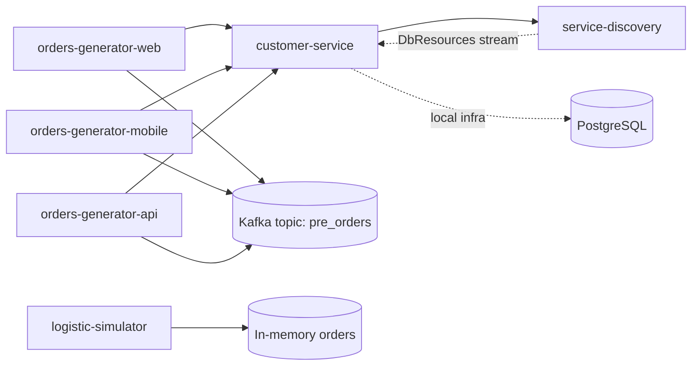
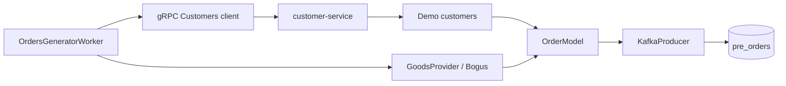
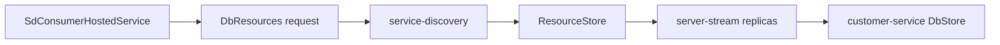

# Logistics Platform

[](LICENSE)


Production-like demo-платформа для моделирования логистической системы на микросервисной архитектуре.

Проект демонстрирует генерацию заказов из нескольких источников, gRPC-взаимодействие между сервисами, публикацию сообщений в Kafka, Service Discovery через server-streaming gRPC и локальную инфраструктуру, поднимаемую одной командой через Docker Compose.

## Основные возможности

- Генерация заказов из трех независимых источников: `WebSite`, `Mobile` и `Api`.
- Получение клиентских данных из `customer-service` через gRPC.
- Публикация заказов в Kafka topic `pre_orders` с JSON payload.
- Service Discovery для передачи информации о доступных репликах и bucket-диапазонах.
- Server-streaming gRPC между `customer-service` и `service-discovery`.
- gRPC Reflection для удобной локальной проверки контрактов.
- Локальный Kafka-кластер из двух broker-контейнеров и Zookeeper.
- PostgreSQL-контейнер для локальной инфраструктуры `customer-service`.
- `logistic-simulator` с in-memory моделью жизненного цикла заказа и gRPC endpoint для отмены.
- Docker Compose запуск всей системы одной командой.
- Конфигурация сервисов через environment variables.

## Ключевой сценарий работы

1. Запускается Docker Compose окружение с сервисами, Kafka, Zookeeper и PostgreSQL.
2. `service-discovery` читает конфигурацию кластеров из `LOGISTICS_DB_STATE`.
3. `customer-service` открывает gRPC endpoint и подписывается на поток `DbResources` в `service-discovery`.
4. `service-discovery` периодически отправляет `customer-service` актуальный список реплик для кластера.
5. Три экземпляра `orders-generator` стартуют с разными значениями `LOGISTICS_ORDER_SOURCE`.
6. Каждый генератор в фоне запрашивает список клиентов у `customer-service` через gRPC.
7. Генератор выбирает случайного клиента, формирует товары через Bogus и собирает модель заказа.
8. Заказ сериализуется в JSON и публикуется в Kafka topic `pre_orders`.
9. `logistic-simulator` хранит заказы в in-memory repository, умеет обновлять состояния и обрабатывать gRPC-запрос на отмену заказа.
10. Поведение системы можно наблюдать через логи контейнеров и сообщения в Kafka.

## Архитектура

Система разделена на небольшие сервисы с отдельными зонами ответственности. Коммуникация между сервисами построена на gRPC и Kafka, а инфраструктурные параметры передаются через переменные окружения.

Основные зоны ответственности:

- `LogisticsPlatform.CustomerService` - gRPC-сервис клиентов, выдача demo-данных, подписка на Service Discovery.
- `LogisticsPlatform.OrdersGenerator` - фоновая генерация заказов, gRPC-клиент `customer-service`, Kafka producer.
- `LogisticsPlatform.ServiceDiscovery` - server-streaming gRPC-сервис для распространения сведений о репликах.
- `LogisticsPlatform.LogisticsSimulator` - in-memory модель заказов, обработчики регистрации, обновления и отмены.
- `docker-compose.yml` - локальная инфраструктура: сервисы, Kafka, Zookeeper, PostgreSQL и healthchecks.
- `Protos` / `Proto` - gRPC-контракты для взаимодействия между сервисами.

Внешние зависимости подключаются через интерфейсы и DI. Генераторы заказов используют один и тот же Docker image, но получают разные роли через environment variables.

## Mermaid-схемы

Компонентная архитектура:



Основной поток генерации заказа:



Service Discovery поток:



## Технологический стек

| Область | Технологии |
| --- | --- |
| Backend | .NET 8, ASP.NET Core, C# |
| Межсервисное API | gRPC, Protocol Buffers, gRPC Reflection |
| Messaging | Apache Kafka, Confluent.Kafka |
| Service Discovery | Server-streaming gRPC, in-memory resource store |
| Генерация данных | Bogus |
| Data / infra | PostgreSQL 16 Alpine, in-memory demo storage |
| Контейнеризация | Docker, Docker Compose |
| Документация / проверка API | Swagger packages, gRPC Reflection |

## Backend-особенности / Технические акценты

- Несколько экземпляров `orders-generator` запускаются из одного проекта и отличаются только конфигурацией.
- Фоновая генерация заказов реализована через `BackgroundService`.
- Kafka producer использует ключ заказа и JSON-сериализацию payload.
- gRPC-клиент `customer-service` подключен через `Grpc.Net.ClientFactory`.
- Для gRPC-вызовов генератора подключен `LoggingInterceptor`.
- `service-discovery` использует server-streaming gRPC для push-обновлений клиентам.
- Конфигурация реплик задается строкой `LOGISTICS_DB_STATE` и преобразуется в bucket-диапазоны.
- `customer-service` хранит актуальные endpoint-данные из Service Discovery в локальном `DbStore`.
- `logistic-simulator` использует handler-подход и in-memory repository для смены состояний заказа.
- Kestrel настраивается под HTTP/2 для gRPC endpoint'ов.
- Docker Compose содержит healthchecks для PostgreSQL, Zookeeper и Kafka brokers.

## Интеграции

| Интеграция | Как используется | Локальный режим |
| --- | --- | --- |
| gRPC Customers | Генераторы получают клиентов и адреса из `customer-service` | Работает внутри Docker network |
| Kafka | Генераторы публикуют заказы в topic `pre_orders` | Два broker-контейнера: `broker-1`, `broker-2` |
| Service Discovery | `customer-service` получает поток данных о репликах | Конфигурируется через `LOGISTICS_DB_STATE` |
| PostgreSQL | Локальный инфраструктурный контейнер для `customer-service` | Доступен на `localhost:5400` |
| Logistics Simulator gRPC | Обработка отмены заказа и in-memory lifecycle | Запускается отдельным контейнером без внешнего порта |
| Docker Compose | Оркестрация локального окружения | `docker compose up --build` из корня репозитория |

## Локальный запуск

Требования:

- .NET SDK 8.x
- Docker с Docker Compose
- Опционально: gRPC-клиент вроде `grpcurl` или IDE tooling для проверки gRPC Reflection

## Запуск через Docker

Весь стек можно поднять одной командой из корня репозитория:

```bash
docker compose up --build
```

Будут запущены:

- `customer-service`
- `orders-generator-web`
- `orders-generator-mobile`
- `orders-generator-api`
- `service-discovery`
- `logistic-simulator`
- `customer-service-db`
- `zookeeper`
- `broker-1`
- `broker-2`

Адреса и порты:

- Customer Service gRPC: `http://localhost:5081`
- Service Discovery gRPC: `http://localhost:5500`
- Kafka broker 1: `localhost:29091`
- Kafka broker 2: `localhost:29092`
- PostgreSQL: `localhost:5400` (`database=customer-service`, `user=test`, `password=test`)

Посмотреть логи генераторов:

```bash
docker compose logs -f orders-generator-web orders-generator-mobile orders-generator-api
```

Посмотреть сообщения в Kafka topic:

```bash
docker compose exec broker-1 kafka-console-consumer --bootstrap-server broker-1:9091 --topic pre_orders --from-beginning
```

Остановить стек:

```bash
docker compose down
```

Остановить стек и удалить volume с PostgreSQL-данными:

```bash
docker compose down -v --remove-orphans
```

## Конфигурация

Основная конфигурация задается в `docker-compose.yml`. Значения предназначены для локального demo/development запуска.

| Переменная | Где используется | Назначение |
| --- | --- | --- |
| `LOGISTICS_SD_ADDRESS` | `customer-service` | Адрес `service-discovery` для gRPC-подписки |
| `LOGISTICS_GRPC_PORT` | `customer-service` | Порт gRPC endpoint'а |
| `LOGISTICS_HTTP_PORT` | `customer-service` | Порт HTTP endpoint'а |
| `LOGISTICS_DB_STATE` | `service-discovery` | Описание кластеров, реплик и bucket-диапазонов |
| `LOGISTICS_UPDATE_TIMEOUT` | `service-discovery` | Интервал отправки обновлений в stream |
| `LOGISTICS_ORDER_SOURCE` | `orders-generator` | Источник заказа: `WebSite`, `Mobile` или `Api` |
| `LOGISTICS_KAFKA_BROKERS` | `orders-generator` | Список Kafka brokers |
| `LOGISTICS_ORDER_REQUEST_TOPIC` | `orders-generator` | Topic для публикации заказов |
| `LOGISTICS_CUSTOMER_ADDRESS` | `orders-generator` | Адрес gRPC endpoint'а `customer-service` |

Пример описания состояния Service Discovery:

```text
cluster:0-9:db1:1543;cluster:10-19:db2:1543;cluster1:0:db3:1543
```

Формат одной записи:

```text
<cluster-name>:<bucket-range>:<host>:<port>
```

## gRPC-контракты

Основные proto-контракты находятся внутри сервисов:

- `src/LogisticsPlatform.CustomerService/Protos/customers.proto` - методы `GetCustomers`, `GetCustomersForGenerator`, `GetCustomerById`, `CreateCustomer`.
- `src/LogisticsPlatform.ServiceDiscovery/Protos/sd.proto` - server-streaming метод `DbResources`.
- `src/LogisticsPlatform.LogisticsSimulator/Proto/LogisticsSimulator.proto` - метод `OrderCancel`.

gRPC Reflection включен для сервисов, поэтому контракты можно изучать через совместимые инструменты без ручного копирования proto-файлов.

## Проверка качества

Команды для локальной проверки из корня репозитория:

```bash
dotnet build LogisticsPlatform.sln
docker compose config
```

Ручной smoke-test:

- Запустить стек через `docker compose up --build`.
- Убедиться, что `broker-1`, `broker-2`, `zookeeper` и `customer-service-db` прошли healthcheck.
- Проверить логи `orders-generator-web`, `orders-generator-mobile` и `orders-generator-api`.
- Подключиться к Kafka topic `pre_orders` и убедиться, что заказы публикуются.
- Проверить, что `customer-service` получает обновления от `service-discovery` в логах.

## Статус проекта

- Реализован локальный микросервисный стенд с gRPC, Kafka и Docker Compose.
- Генераторы заказов публикуют сообщения в Kafka и получают клиентов через gRPC.
- Service Discovery реализован через server-streaming gRPC и in-memory store.
- `customer-service` сейчас отдает demo-набор клиентов из памяти; PostgreSQL поднят как инфраструктурный контейнер для локального окружения.
- `logistic-simulator` содержит in-memory lifecycle заказов и gRPC-операцию отмены; Kafka consumer для него можно добавить следующим этапом.
- Полноценная авторизация, observability-стек и CI/CD pipeline намеренно не входят в текущий demo-объем.

## Лицензия

MIT License. Подробнее см. `LICENSE`.
